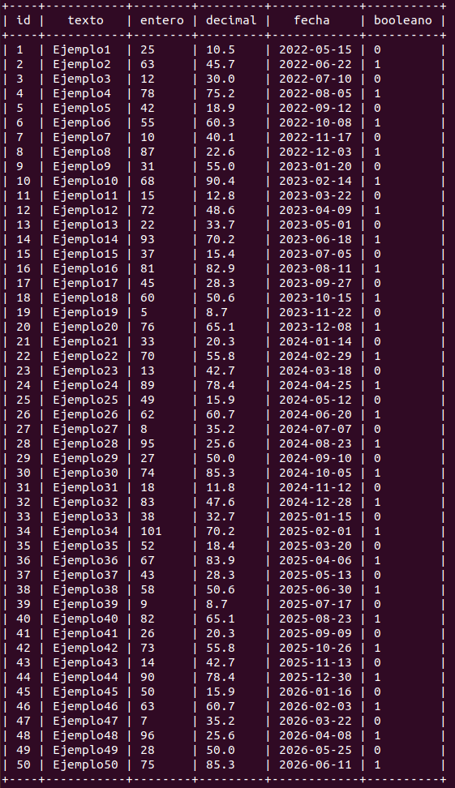

## Creacion de tabla

```sql
CREATE TABLE Ejemplo (
    id INTEGER NOT NULL PRIMARY KEY AUTOINCREMENT,
    texto TEXT NOT NULL,
    entero INTEGER NOT NULL,
    decimal REAL NOT NULL,
    fecha DATE NOT NULL,
    booleano BOOLEAN NOT NULL );
```

## Añadir informacion de la tabla
```sql
INSERT INTO Ejemplo ( texto, entero, decimal, fecha, booleano )
VALUES ('Ejemplo1', '25', '10.5', '2022-05-15', '0'), ('Ejemplo2', '63', '45.7', '2022-06-22', '1'), ('Ejemplo3', '12', '30.0', '2022-07-10', '0'),
('Ejemplo4', '78', '75.2', '2022-08-05', '1'), ('Ejemplo5', '42', '18.9', '2022-09-12', '0'), ('Ejemplo6', '55', '60.3', '2022-10-08', '1'),
('Ejemplo7', '10', '40.1', '2022-11-17', '0'), ('Ejemplo8', '87', '22.6', '2022-12-03', '1'), ('Ejemplo9', '31', '55.0', '2023-01-20', '0'), 
('Ejemplo10', '68', '90.4', '2023-02-14', '1'), ('Ejemplo11', '15', '12.8', '2023-03-22', '0'), ('Ejemplo12', '72', '48.6' ,'2023-04-09', '1'), ('Ejemplo13', '22', '33.7', '2023-05-01', '0'), ('Ejemplo14', '93', '70.2', '2023-06-18', '1'), ('Ejemplo15', '37', '15.4', '2023-07-05', '0'),
('Ejemplo16', '81', '82.9', '2023-08-11', '1'), ('Ejemplo17', '45', '28.3', '2023-09-27', '0'), ('Ejemplo18', '60', '50.6', '2023-10-15', '1'), ('Ejemplo19', '5', '8.7', '2023-11-22', '0'), ('Ejemplo20', '76', '65.1', '2023-12-08', '1'), ('Ejemplo21', '33', '20.3', '2024-01-14', '0'),
('Ejemplo22', '70', '55.8', '2024-02-29', '1'), ('Ejemplo23', '13', '42.7', '2024-03-18', '0'), ('Ejemplo24', '89', '78.4', '2024-04-25', '1'), ('Ejemplo25', '49', '15.9', '2024-05-12', '0'), ('Ejemplo26', '62', '60.7', '2024-06-20', '1'), ('Ejemplo27', '8', '35.2', '2024-07-07', '0'),
('Ejemplo28', '95', '25.6', '2024-08-23', '1'), ('Ejemplo29', '27', '50.0', '2024-09-10', '0'), ('Ejemplo30', '74', '85.3', '2024-10-05', '1'), ('Ejemplo31', '18', '11.8', '2024-11-12', '0'), ('Ejemplo32', '83', '47.6', '2024-12-28', '1'), ('Ejemplo33', '38', '32.7', '2025-01-15', '0'),
('Ejemplo34', '101', '70.2', '2025-02-01', '1'), ('Ejemplo35', '52', '18.4', '2025-03-20', '0'), ('Ejemplo36', '67', '83.9', '2025-04-06', '1'), ('Ejemplo37', '43', '28.3', '2025-05-13', '0'), ('Ejemplo38', '58', '50.6', '2025-06-30', '1'), ('Ejemplo39', '9', '8.7', '2025-07-17', '0'),
('Ejemplo40', '82', '65.1', '2025-08-23', '1'), ('Ejemplo41', '26', '20.3', '2025-09-09', '0'), ('Ejemplo42', '73', '55.8', '2025-10-26', '1'), ('Ejemplo43', '14', '42.7', '2025-11-13', '0'), ('Ejemplo44', '90', '78.4', '2025-12-30', '1'), ('Ejemplo45', '50', '15.9', '2026-01-16', '0'),('Ejemplo46', '63', '60.7', '2026-02 22', '0'), ('Ejemplo48', '96', '25.6', '2026-04-08', '1'), ('Ejemplo49', '28', '50.0', '2026-05-25', '0'), ('Ejemplo50', '75', '85.3', '2026-06-11', '1');
```

## Consultas

### Obtén todas las entradas de la tabla Ejemplo

```sql
select * from Ejemplo;
```


### Obtén las entradas con el campo entero mayor a 50.

```sql
select * from Ejemplo where entero>50;
```

### Elimina las entradas donde el campo booleano es igual a True.

```sql
DELETE FROM Ejemplo WHERE booleano = 1;
```
### Modifica el campo texto de las entradas donde el campo entero es menor a 30 y establece el texto como "Modificado" 

```sql
UPDATE Ejemplo set entero="Modificado"   WHERE entero>30 
```
### Elimina las entradas donde el campo entero es igual a 50.

```sql
DELETE FROM Ejemplo WHERE entero = 50;
```

### Incrementa en 10 el valor del campo entero para las entradas donde el campo booleano es igual a False.

```sql
UPDATE Ejemplo set entero= entero+10   WHERE booleano=0; 
```

### Elimina las entradas donde el campo decimal es menor a 50.

```sql
DELETE FROM Ejemplo WHERE entero<50;
```

### Actualiza el campo fecha de todas las entradas a la fecha actual.

```sql
UPDATE FROM Ejemplo set fecha= DATE   WHERE fecha 
```


